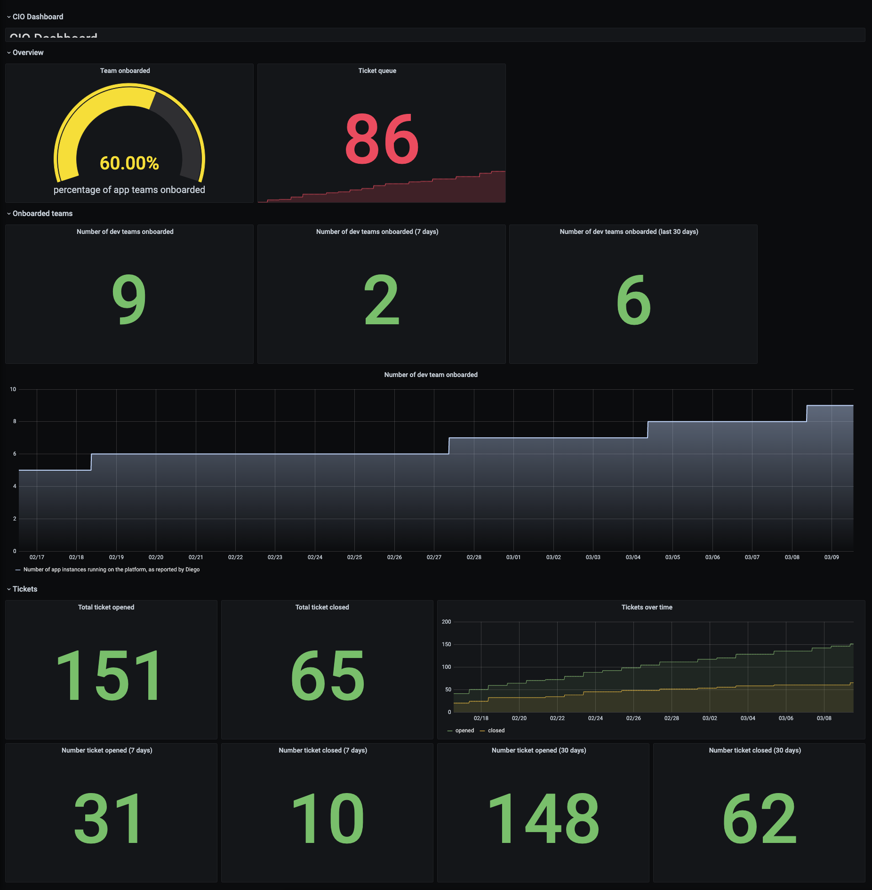

# Generate backfilling data in prometheus/grafana

This is heavily inspired by the following [blog post](https://medium.com/tlvince/prometheus-backfilling-a92573eb712c).

## Getting started

- Start an ubuntu instance on your favorite cloud provider or locally
- Install prometheus (dirty way)

```bash
$ wget https://github.com/prometheus/prometheus/releases/download/v2.25.0/prometheus-2.25.0.linux-amd64.tar.gz
$ tar -xzf prometheus-2.25.0.linux-amd64.tar.gz
$ export PATH=$PATH:$PWD/prometheus-2.25.0.linux-amd64
$ prometheus -h
$ cat << EOF > prometheus.yml
global:
  scrape_interval:     15s # By default, scrape targets every 15 seconds.

  # Attach these labels to any time series or alerts when communicating with
  # external systems (federation, remote storage, Alertmanager).
  external_labels:
    monitor: 'codelab-monitor'

# A scrape configuration containing exactly one endpoint to scrape:
# Here it's Prometheus itself.
scrape_configs:
  # The job name is added as a label `job=<job_name>` to any timeseries scraped from this config.
  - job_name: 'prometheus'

    # Override the global default and scrape targets from this job every 5 seconds.
    scrape_interval: 5s

    static_configs:
      - targets: ['localhost:9090']
EOF
```

- Install grafana

```bash
$ wget https://dl.grafana.com/oss/release/grafana_7.1.5_amd64.deb
$ sudo apt-get install -y adduser libfontconfig
$ sudo dpkg -i grafana_7.1.5_amd64.deb
$ sudo systemctl daemon-reload && sudo systemctl enable grafana-server && sudo systemctl start grafana-server
$ curl -v http://localhost:3000
```

- Add the prometheus source to grafana 

  * Click on the Grafana logo to open the sidebar.
  * Click on “Data Sources” in the sidebar.
  * Choose “Add New”.
  * Select “Prometheus” as the data source.
  * Set the Prometheus server URL (in our case: http://localhost:9090/)
  * Click “Add” to test the connection and to save the new data source.

- Generate and import the fake data in prometheus (see [script](generate_openmetrics.py) and [sample output](ticket.metrics.gz))

```bash
$ sudo apt install python3-pip
$ sudo pip3 install numpy
$ python3 generate_openmetrics.py > ticket.metrics
$ promtool tsdb create-blocks-from openmetrics ticket.metrics data/
```

- Start prometheus

```bash
$ prometheus --config.file=prometheus.yml --storage.tsdb.retention.time=60d
```

- Check the data, open the prometheus metric browser in your favorite browser `http://<FQDN>:9090/graph`, below few "interesting" promql queries

```
pcf_ticket_opened_total[4w:1d]
pcf_ticket_closed_total
increase(pcf_ticket_closed_total[4w])
onboarded_team
```

- Import the dashboard in grafana

  * open [`dashboard.json`](dashboard.json) in your favorite editor
  * login to grafana using `http://<FQDN>:3000` with admin/admin
  * In the sidebar, click on "Create"
  * Choose "Import"
  * Paste the content of [`dashboard.json`](dashboard.json) into text area
  * Click load button

The result should look like something like below.

